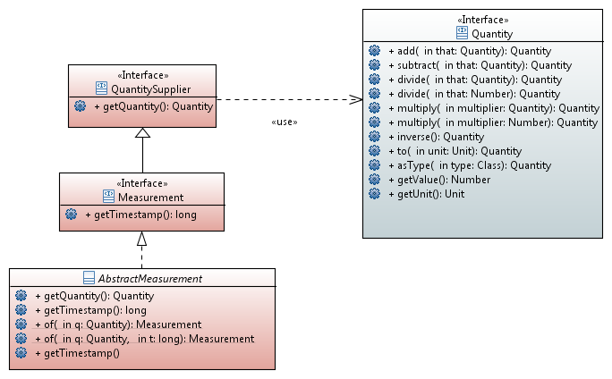

## Measurement Interface
The reference implementation SPI provides a <code>Measurement</code> interface which is not part of JSR 363 API (see FAQ for a rational about why Measurement is excluded from the API). The RI interpretation of “measurement” is only one of many possible interpretations, and is not suitable for all needs. For example it currently holds no information about measurement precision and can not describe non-scalar measurements like wind vectors.
Along the lines of Martin Fowler ( [FOWLER1996], [FOWLER1999]), The Open Geospatial Consortium 
([OGC_SWEDCM], [OGC_OM]), or [BIPM_VIM] the RI separates Quantity and (Measurement) Unit from the effort of Measurement. Beside Fowler et al., the Sensor Web Enablement standard by the Open Geospatial Consortium [OGC_SWEDCM] refers to gathered information as “observation” or “sensor related data”. [OGC_OM] another standard closely related to Sensor Web Enablement calls the quantity “measurand” while “measurement” is a set of operations having the object of determining the value of a quantity. Similar to [FOWLER1999] both use the term “observation”, too. The likes of Google Fit or Xively use terms like “dataset” or “data stream”

Legend:
* Blue: API
* Red:  RI

 
Note that the above UML restricts measurements to scalar values through its association to a single Quantity, which is a main reason why we currently define Measurement at the implementation level rather than in the API. Furthermore, defining Measurement on the implementation level also allows e.g. SE 8 specific implementations to use [JSR-310] for the timestamp while the Reference Implementation remains compatible with ME 8 and other Embedded platforms, using long as timestamp like many other APIs e.g. [OSGIM].